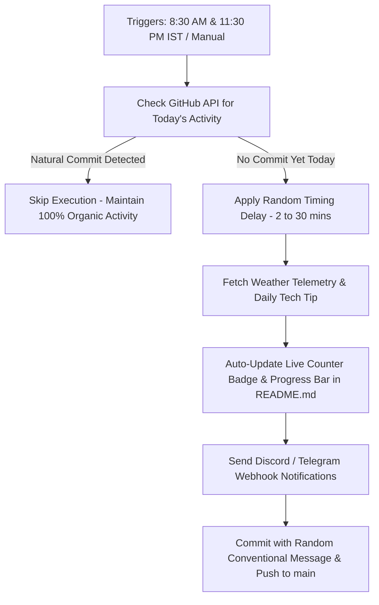

<div align="center">

# 🌱 Evergreen Streak

> 🚀 Smart, Organic & Automated GitHub Streak Saver  
> An intelligent **GitHub Actions** workflow featuring real-world weather telemetry, daily developer tech tips, annual streak progress bars, 11:30 PM emergency fail-safe triggers, and optional Discord/Telegram notifications! 🌿


</div>

---

🎯 **2026 Annual Goal**: [`████████████░░░░░░░░`] **225/365 Days** (61%)

> 💡 **Developer Tip of the Day**: Use `git commit --amend --no-edit` to quickly add staged changes to your last commit.

---

## ✨ Advanced Feature Suite

🛡️ **Smart Safety Net (Check-Before-Commit)**  
Queries GitHub API before executing. If you have already made commits today across your public repos, it **skips execution** so your activity looks 100% natural!

🚨 **Dual-Check Fail-Safe (8:30 AM & 11:30 PM IST)**  
Runs a morning check (8:30 AM IST) and a late-night emergency check (11:30 PM IST) before midnight so your streak is guaranteed never to break.

🌤️ **Real-World Weather Telemetry**  
Fetches real-time weather & temperature data (in IST) via Open-Meteo API and logs telemetry in your history record.

💡 **Daily Developer Tips & Insights**  
Rotates actionable Git, Python, JavaScript, and CLI productivity tips in both `README.md` and commit details.

🎲 **Organic Timing Jitter**  
Adds a randomized delay (2 to 30 minutes) before committing so execution times naturally vary every day.

📊 **Annual Streak Goal Progress Bar**  
Renders a dynamic visual ASCII progress bar directly in `README.md` tracking annual streak progress!

🔔 **Instant Webhook Notifications (Discord & Telegram)**  
Optionally notifies your phone, Discord server, or Telegram chat whenever a streak commit is safely generated.

---

## 🧠 Architecture & Execution Workflow



---

## 🕒 Example Activity Log Output

Your [`history.md`](file:///d:/GithubAuto/Github-Streak-Saver-main/history.md) log entries look like this:

| Date & Time (IST) | Action | Weather Telemetry | Daily Tech Quote / Tip | Status |
|---|---|---|---|---|
| 2026-08-13 03:15:30 IST | Streak Safety Backup | ☀️ Clear 28°C | *Clean code always looks like it was written by someone who cares.* | ✅ Active |

---

## 🔔 Setting Up Notifications (Optional)

Want instant notifications on your phone or Discord server when a streak is saved?

1. Go to your repository → **Settings** → **Secrets and variables** → **Actions**.
2. Click **New repository secret**:
   - **Discord**: Name = `DISCORD_WEBHOOK`, Value = Your Discord Webhook URL.
   - **Telegram**:
     - Name = `TELEGRAM_BOT_TOKEN`, Value = Your Bot API Token.
     - Name = `TELEGRAM_CHAT_ID`, Value = Your Telegram Chat ID.

If secrets are not added, the notification step is safely skipped!

---

## ⚙️ Workflow Setup

The workflow file is located at:

```
.github/workflows/streak.yml
```

---

## 🚀 Getting Started

### 1️⃣ Fork or Clone This Repository

```bash
git clone https://github.com/Karnvendrasingh/evergreen-streak.git
cd evergreen-streak
```

### 2️⃣ Enable GitHub Actions Permissions

- Go to **Settings** → **Actions** → **General**
- Under **Workflow permissions**, select:
  - ✅ **Read and write permissions**
  - ✅ **Allow GitHub Actions to create and approve pull requests**

---

## 🧑‍💻 Created By

**Karnvendra Singh**  
💼 [GitHub](https://github.com/Karnvendrasingh) • 🌍 [LinkedIn](https://www.linkedin.com/in/karnvendrasingh/) • 📧 [Email](mailto:karnvendrasingh@gmail.com) • 🧠 Automating Everyday Productivity

---

## 📜 License

This project is licensed under the **MIT License** – feel free to use and modify it!

---

<div align="center">

**Made with ❤️ and ☕ by [Karnvendra Singh](https://github.com/Karnvendrasingh)**

</div>
