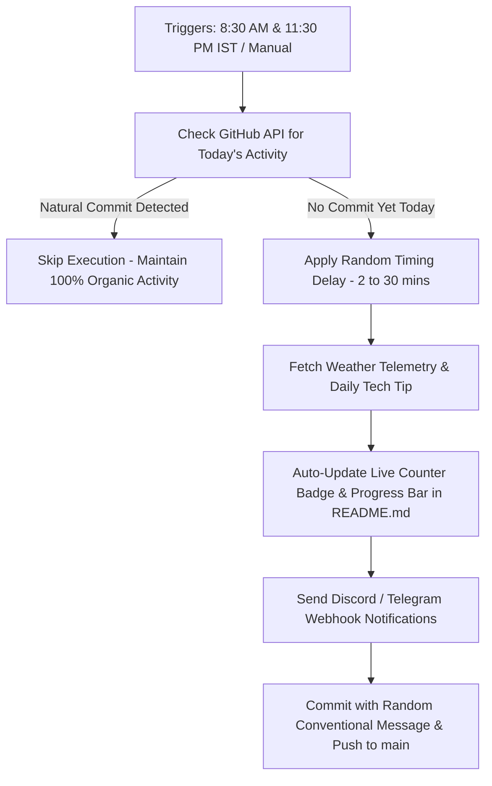

<div align="center">

# 🌱 Evergreen Streak

> 🚀 **Smart, Organic & Fail-Safe GitHub Streak Preservation Engine**  
> An intelligent **GitHub Actions** automation system that protects your GitHub contribution graph—firing only when you haven't committed naturally, featuring real-world weather telemetry, daily developer tech tips, live annual progress tracking, 11:30 PM emergency fail-safe triggers, and instant Discord/Telegram notifications! 🌿


</div>

---

🎯 **2026 Annual Goal**: [`████████████░░░░░░░░`] **231/365 Days** (63%)

> 💡 **Clean Code**: Keep functions small and focused on doing a single task exceptionally well.

---

## 📋 Table of Contents
- [✨ Key Innovations & Features](#-key-innovations--features)
- [🧠 Execution Architecture](#-execution-architecture)
- [🕒 Activity Log Preview](#-activity-log-preview)
- [🔔 Webhook Notifications Setup](#-setting-up-notifications-optional)
- [🚀 Quick Start & Setup Guide](#-getting-started)
- [🧑‍💻 Author & License](#-created-by)

---

## ✨ Key Innovations & Features

| Feature | Description | Realism Impact |
|---|---|---|
| 🛡️ **Smart Safety Net** | Queries GitHub REST API; skips execution if you've already committed today across public repositories. | 100% Organic |
| 🚨 **Dual-Check Fail-Safe** | Runs morning check (8:30 AM IST) & late-night check (11:30 PM IST) to guarantee streak safety before midnight. | Fail-Safe Protection |
| 🌤️ **Weather Telemetry** | Fetches live temperature & conditions (IST) via Open-Meteo API and logs context in history records. | Context-Aware |
| 💡 **Daily Tech Tips** | Rotates actionable Git, Python, JS, & CLI productivity tips in `README.md` and commit details. | Educational Value |
| 🎲 **Organic Timing Jitter** | Adds random execution delay (2 to 30 mins) so commit timestamps naturally vary every day. | Human-like Jitter |
| 📊 **Annual Goal Progress Bar** | Auto-calculates current day of year and renders a dynamic ASCII progress bar in `README.md`. | Live Visuals |
| 🔔 **Instant Webhooks** | Sends notifications to Discord channels or Telegram bots when repository secrets are set. | Real-Time Alerts |

---

## 🧠 Execution Architecture



---

## 🕒 Activity Log Preview

Your [`history.md`](file:///d:/GithubAuto/Github-Streak-Saver-main/history.md) maintains clean, transparent records:

| Date & Time (IST) | Action | Weather Telemetry | Daily Tech Quote / Tip | Status |
|---|---|---|---|---|
| 2026-08-13 03:15:30 IST | Streak Safety Backup | ☀️ Clear 28°C | *Clean code always looks like it was written by someone who cares.* | ✅ Active |

---

## 🔔 Setting Up Notifications (Optional)

Want instant notifications on your phone or Discord server when a streak is saved?

1. Go to your repository → **Settings** → **Secrets and variables** → **Actions**.
2. Click **New repository secret**:
   - **Discord**: Name = `DISCORD_WEBHOOK`, Value = Your Discord Webhook URL.
   - **Telegram**:
     - Name = `TELEGRAM_BOT_TOKEN`, Value = Your Bot API Token.
     - Name = `TELEGRAM_CHAT_ID`, Value = Your Telegram Chat ID.

If secrets are not configured, the notification step is safely skipped!

---

## 🚀 Getting Started

### 1️⃣ Fork or Clone This Repository

```bash
git clone https://github.com/Karnvendrasingh/evergreen-streak.git
cd evergreen-streak
```

### 2️⃣ Enable GitHub Actions Permissions

- Go to **Settings** → **Actions** → **General**
- Under **Workflow permissions**, select:
  - ✅ **Read and write permissions**
  - ✅ **Allow GitHub Actions to create and approve pull requests**

### 3️⃣ Manual Execution (Optional)

You can trigger a manual run anytime:
1. Go to **Actions** → Select **Evergreen Streak Saver**.
2. Click **Run workflow** ➔ **Run workflow**.

---

## 🧑‍💻 Created By

**Karnvendra Singh**  
💼 [GitHub](https://github.com/Karnvendrasingh) • 🌍 [LinkedIn](https://www.linkedin.com/in/karnvendrasingh/) • 📧 [Email](mailto:karnvendrasingh@gmail.com) • 🧠 Automating Everyday Productivity

---

## 📜 License

This project is licensed under the **MIT License** – feel free to use and modify it!

---

<div align="center">

**Made with ❤️ and ☕ by [Karnvendra Singh](https://github.com/Karnvendrasingh)**

</div>
