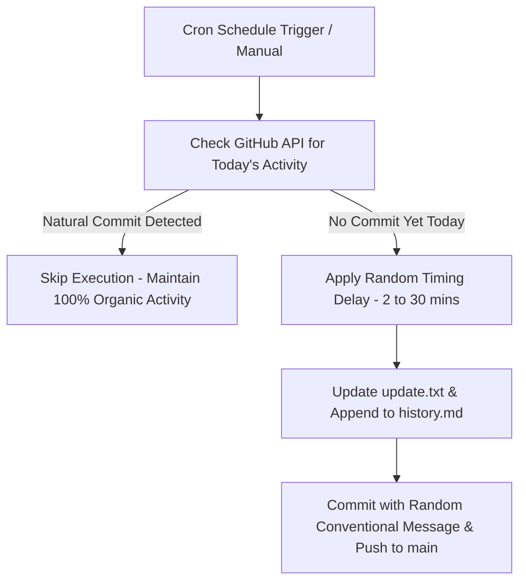

<div align="center">

# 🌱 Evergreen Streak

> 🚀 Smart, Organic & Automated GitHub Streak Saver  
> An intelligent **GitHub Actions** workflow that acts as a safety net for your GitHub contribution streak—firing only when you haven't committed naturally, with random execution timing and human-like commit messages! 🌿


</div>

---

## ✨ Smart & Organic Features

🛡️ **Smart Safety Net (Check-Before-Commit)**  
Checks GitHub API before executing. If you have already made commits today, it **skips execution** so your activity looks 100% natural!

🎲 **Organic Timing Jitter**  
Adds a randomized delay (2 to 30 minutes) before committing so execution times naturally vary every day instead of hitting the exact same minute.

💬 **Human-Like Conventional Commit Messages**  
Randomly selects clean, professional commit messages (`docs: sync daily activity log`, `chore: update status timestamp`, `refactor: refresh build metadata`).

📖 **Structured Activity History Log**  
Appends clean, formatted Markdown records to [`history.md`](file:///d:/GithubAuto/Github-Streak-Saver-main/history.md) for transparent, clean activity history tracking.

---

## 🧠 How It Works



1. **GitHub Action** triggers daily.
2. Checks GitHub REST API for your public events today (`Karnvendrasingh`).
3. If activity exists: outputs notice and skips.
4. If no activity: waits for a random delay, updates `update.txt` and `history.md`, and pushes a commit with a conventional message.

---

## 🕒 Example Activity Output

Your [`history.md`](file:///d:/GithubAuto/Github-Streak-Saver-main/history.md) log entries look like this:

| Date & Time (IST) | Action | Status |
|---|---|---|
| 2026-08-13 08:42:15 IST | Streak Safety Backup | ✅ Active |

---

## ⚙️ Workflow Setup

The workflow file is located at:

```
.github/workflows/streak.yml
```

### 💾 Full Workflow Code

```yaml
name: Evergreen Streak Saver

on:
  schedule:
    - cron: '0 3 * * *'  # Runs daily at 8:30 AM IST
  workflow_dispatch:      # Manual trigger anytime

jobs:
  update-commit:
    runs-on: ubuntu-latest
    permissions:
      contents: write

    steps:
      - name: Checkout repository
        uses: actions/checkout@v4

      - name: Smart Activity Check
        id: check_activity
        run: |
          TODAY=$(TZ='Asia/Kolkata' date '+%Y-%m-%d')
          EVENTS=$(curl -s -H "Accept: application/vnd.github+json" "https://api.github.com/users/Karnvendrasingh/events/public" || echo "[]")
          COMMITTED_TODAY=$(echo "$EVENTS" | grep -E "\"type\": \"PushEvent\"" -A 5 | grep "\"created_at\": \"$TODAY" || true)
          
          if [ -n "$COMMITTED_TODAY" ] && [ "${{ github.event_name }}" != "workflow_dispatch" ]; then
            echo "Natural commit detected for today ($TODAY)! Skipping automated commit."
            echo "skip=true" >> $GITHUB_OUTPUT
          else
            echo "skip=false" >> $GITHUB_OUTPUT
          fi

      - name: Organic Timing Jitter
        if: steps.check_activity.outputs.skip != 'true'
        run: |
          if [ "${{ github.event_name }}" == "schedule" ]; then
            DELAY=$((RANDOM % 1680 + 120))
            sleep $DELAY
          fi

      - name: Update Activity Logs
        if: steps.check_activity.outputs.skip != 'true'
        run: |
          TIMESTAMP=$(TZ='Asia/Kolkata' date '+%Y-%m-%d %H:%M:%S %Z')
          DATE_ONLY=$(TZ='Asia/Kolkata' date '+%Y-%m-%d')
          TIME_ONLY=$(TZ='Asia/Kolkata' date '+%H:%M:%S %Z')
          echo "Last updated: $TIMESTAMP" > update.txt
          echo "| $DATE_ONLY $TIME_ONLY | Streak Safety Backup | ✅ Active |" >> history.md

      - name: Commit and Push Changes
        if: steps.check_activity.outputs.skip != 'true'
        run: |
          git config --global user.name "Karnvendrasingh"
          git config --global user.email "karnvendrasingh@gmail.com"
          MESSAGES=(
            "docs: sync daily activity log"
            "chore: update status timestamp"
            "docs: update streak records"
            "refactor: refresh build metadata"
            "docs: log daily session activity"
            "style: update activity metrics"
          )
          SELECTED_MSG="${MESSAGES[$RANDOM % ${#MESSAGES[@]}]}"
          git add update.txt history.md
          git commit -m "$SELECTED_MSG" || echo "No changes to commit"
          git push origin main
```

---

## 🚀 Getting Started

### 1️⃣ Fork or Clone This Repository

```bash
git clone https://github.com/Karnvendrasingh/evergreen-streak.git
cd evergreen-streak
```

### 2️⃣ Enable GitHub Actions Permissions

- Go to **Settings** → **Actions** → **General**
- Under **Workflow permissions**, select:
  - ✅ **Read and write permissions**
  - ✅ **Allow GitHub Actions to create and approve pull requests**

---

## 🧑‍💻 Created By

**Karnvendra Singh**  
💼 [GitHub](https://github.com/Karnvendrasingh) • 🌍 [LinkedIn](https://www.linkedin.com/in/karnvendrasingh/) • 📧 [Email](mailto:karnvendrasingh@gmail.com) • 🧠 Automating Everyday Productivity

---

## 📜 License

This project is licensed under the **MIT License** – feel free to use and modify it!

---

<div align="center">

**Made with ❤️ and ☕ by [Karnvendra Singh](https://github.com/Karnvendrasingh)**

</div>
